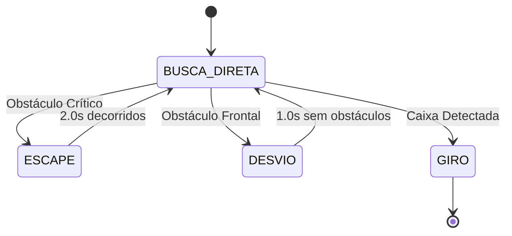

# Relatório - Robô de Busca por Caixa Mais Leve
---

## 🎯 Objetivo Principal
Selecionar dinamicamente a **caixa de menor massa** em um ambiente e navegar até ela, executando um movimento de giro quando estiver suficientemente próxima.

---

## 🤖 Arquitetura do Sistema

### Componentes Principais
| Componente | Função |
|------------|---------|
| **Sensores de Proximidade** | 8 sensores (ps0-ps7) para detecção de obstáculos |
| **Motores** | Controle de movimento das rodas esquerda e direita |
| **Supervisor Webots** | Acesso às propriedades dos objetos no mundo |
| **Sistema de Navegação** | Combinação de busca direta e evasão de obstáculos |

### Estados do Robô


---

## 🔍 Algoritmo de Seleção da Caixa

### Processo de Identificação
1. **Varredura Sistemática**: Busca por objetos com DEF names `CAIXA01` a `CAIXA64`
2. **Cálculo de Massa** (prioridade):
   - 🥇 **Massa Explícita**: Campo `mass` diretamente no nó
   - 🥈 **Volume como Proxy**: `size.x × size.y × size.z`
3. **Seleção Final**: Prioriza caixas com massa explícita sobre volume

### Exemplo de Saída
```
=== PROCURANDO CAIXA MAIS LEVE ===
Caixa CAIXA01: volume = 0.001
Caixa CAIXA11: MASSA EXPLÍCITA = 0.060
🎯 CAIXA MAIS LEVE: CAIXA11 (0.060)
```

---

## 🧭 Sistema de Navegação

### Navegação Direta para Alvo
```c
// Cálculo do ângulo para o alvo
double angle_to_target = atan2(dy, dx) - robot_angle;

// Controle diferencial das rodas
left_speed = V_FWD - angle_to_target * V_TURN_GAIN;
right_speed = V_FWD + angle_to_target * V_TURN_GAIN;
```

### Detecção de Obstáculos
| Sensor | Posição | Função Principal |
|--------|---------|------------------|
| ps0, ps7 | Frontais | Detecção frontal crítica |
| ps1, ps2 | Direita | Obstáculos laterais direitos |
| ps5, ps6 | Esquerda | Obstáculos laterais esquerdos |
| ps3, ps4 | Traseiros | Monitoramento traseiro |

### Limites de Detecção
```c
#define OBSTACLE_THRESHOLD  80.0    // Detecção normal
#define CRITICAL_THRESHOLD  150.0   // Obstáculo muito próximo  
#define SIDE_THRESHOLD      60.0    // Obstáculos laterais
#define DETECT_DIST         0.15    // Distância para iniciar giro
```

---

## 🚦 Estratégias de Evasão

### 1. **Desvio Suave** (Estado `DESVIO`)
- **Ativação**: Obstáculos frontais (`ps0` ou `ps7 > 80`)
- **Comportamento**: Movimento para frente com curva suave
- **Direção**: Baseada em obstáculos laterais
- **Duração**: ~1 segundo ou até obstáculo frontal desaparecer

### 2. **Escape Agressivo** (Estado `ESCAPE`)
- **Ativação**: Obstáculos críticos (`ps0` ou `ps7 > 150`)
- **Comportamento**:
  - 0.8s: Recuo rápido
  - 1.0s: Gira agressivamente
  - 0.2s: Pequeno avanço
- **Direção**: Baseada em menor concentração de obstáculos laterais

### 3. **Correções de Curso**
- Ajustes contínuos baseados em obstáculos laterais
- Redução de velocidade em curvas fechadas
- Monitoramento de progresso (estagnação > 3s)

---

## ⚙️ Parâmetros de Controle

### Velocidades
```c
#define V_FWD       3.0    // Velocidade forward
#define V_TURN_GAIN 2.0    // Ganho para curvas
#define V_SPIN      2.0    // Velocidade de giro
#define V_BACK      -2.0   // Velocidade de recuo
```

### Temporizações
- **Escape**: 2.0 segundos totais
- **Desvio**: Máximo 1.0 segundo
- **Verificação de Progresso**: 3.0 segundos

---

## 📊 Fluxo de Decisão

### Seleção de Direção de Desvio
```python
if obstacle_left and not obstacle_right:
    direction = RIGHT    # -1
elif obstacle_right and not obstacle_left:
    direction = LEFT     # +1
else:
    direction = random.choice([LEFT, RIGHT])
```

### Lógica de Transição de Estados
```
SE distância < 0.1m:
    ESTADO = GIRO
SENÃO SE sensor_frontal > 150:
    ESTADO = ESCAPE
SENÃO SE sensor_frontal > 80 E ESTADO == BUSCA:
    ESTADO = DESVIO
SENÃO SE (ESTADO == DESVIO E 1s decorrido E sem obstáculos):
    ESTADO = BUSCA
```

---

## 🎪 Comportamento Final (GIRO)

### Ativação
- Distância até a caixa alvo < 0.1 metros

### Execução
```c
wb_motor_set_velocity(mL, -V_SPIN);  // Roda esquerda para trás
wb_motor_set_velocity(mR, V_SPIN);   // Roda direita para frente
```

### Resultado
- Robô executa giro contínuo no próprio eixo
- Comemoração visual no console: `🎯🎯🎯`

---

## 🔧 Considerações 

### Limitações Conhecidas
1. **Sensibilidade a Thresholds**: Valores de detecção precisam de calibração por ambiente
2. **Mundo Fechado**: Performance em ambientes muito congestionados pode ser limitada
3. **Orientação Inicial**: Posição inicial muito próxima da caixa requer ajuste

### Pontos Fortes
- ✅ Seleção inteligente baseada em massa/volume
- ✅ Múltiplas estratégias de evasão
- ✅ Tomada de decisão contextual
- ✅ Robustez a diferentes configurações de ambiente

---


*Relatório para o projeto de robótica - Sistema de busca por caixa mais leve*
